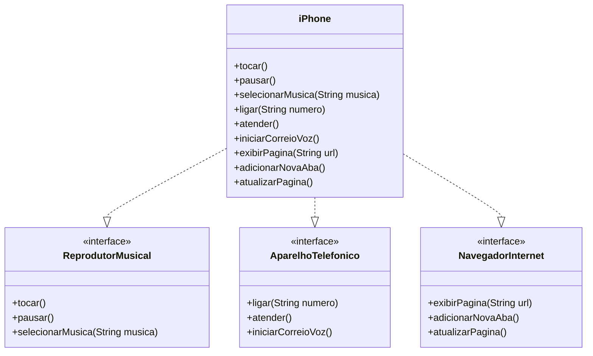

# poo

## Diagrama UML das Funcionalidades

Este projeto modela as funcionalidades de um dispositivo multifuncional (como um iPhone) através de interfaces em Java.

### Interfaces Implementadas:
- **ReprodutorMusical**: Métodos para tocar, pausar e selecionar músicas
- **AparelhoTelefonico**: Métodos para ligar, atender e iniciar correio de voz
- **NavegadorInternet**: Métodos para exibir páginas, adicionar abas e atualizar página

### Classe iPhone:
Implementa todas as três interfaces, simulando um dispositivo que combina essas funcionalidades.

