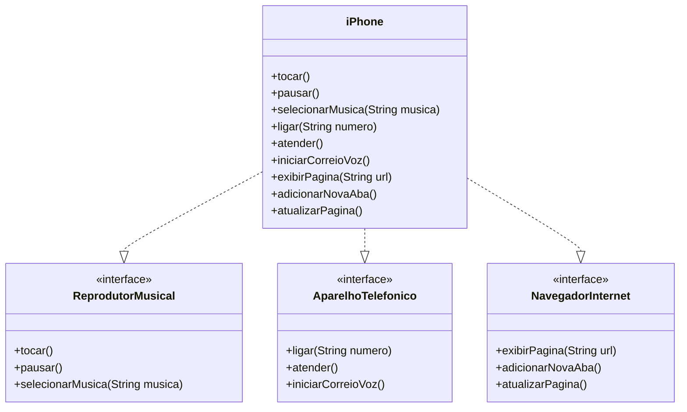

## Getting Started

Welcome to the VS Code Java world. Here is a guideline to help you get started to write Java code in Visual Studio Code.

## Folder Structure

The workspace contains two folders by default, where:

- `src`: the folder to maintain sources
- `lib`: the folder to maintain dependencies

Meanwhile, the compiled output files will be generated in the `bin` folder by default.

> If you want to customize the folder structure, open `.vscode/settings.json` and update the related settings there.

## Dependency Management

The `JAVA PROJECTS` view allows you to manage your dependencies. More details can be found [here](https://github.com/microsoft/vscode-java-dependency#manage-dependencies).

# poo

## Diagrama UML das Funcionalidades

Este projeto modela as funcionalidades de um dispositivo multifuncional (como um iPhone) através de interfaces em Java.

### Interfaces Implementadas:
- **ReprodutorMusical**: Métodos para tocar, pausar e selecionar músicas
- **AparelhoTelefonico**: Métodos para ligar, atender e iniciar correio de voz
- **NavegadorInternet**: Métodos para exibir páginas, adicionar abas e atualizar página

### Classe iPhone:
Implementa todas as três interfaces, simulando um dispositivo que combina essas funcionalidades.

